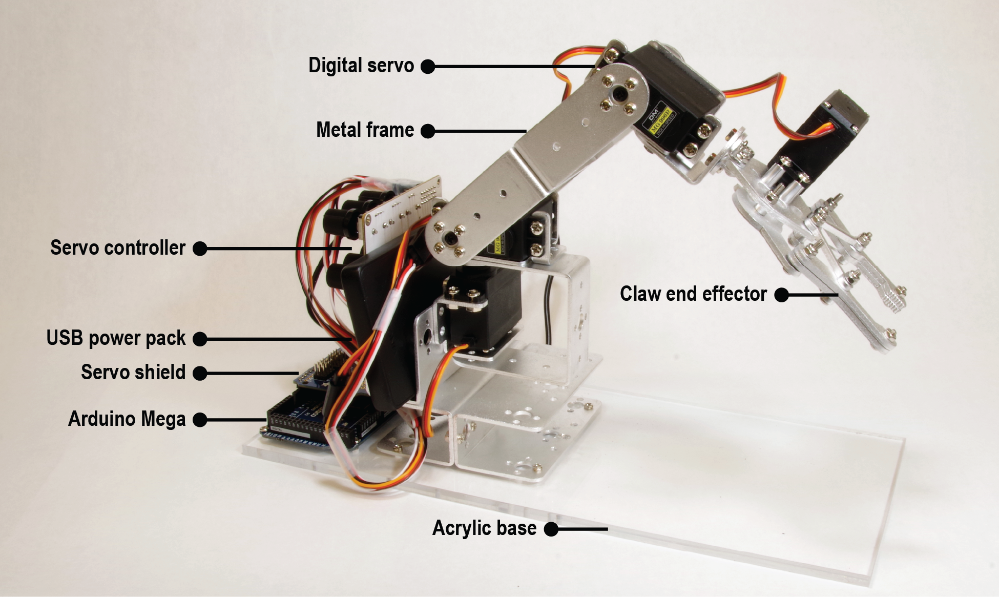

# Robotic Arm Kit 
This is the main repository for the low cost robotic arm kit used in MECH 453/853 at the University of Nebraska-Lincoln and includes MATLAB scripts and Arduino sketches for controlling a robotic arm. 

## Hardware
The following items were used to build the robotic arm kit. Prices were accurate at time of publication. 
| Item                        | Manufacturer/Supplier | Part Number  | Price |
| --------------------------- | --------------------- | ------------ | ----- |
| Robotic arm with servos     | Diymore/Amazon        | B095K61ZMQ   | $80   |
| Microcontroller (METRO 328) | Adafruit              | 2488         | $18   |
| 16-Channel servo shield     | Adafruit              | 1411         | $17   |
| USB power pack              | CoolerGuys            | 840556071235 | $1    |
| Toolbox                     | Arko-Mils/Amazon      | 09514CFT     | $20   |
| Acrylic sheet               | McMaster              | 4615T27      | $10   |
|                             |                       |   **Total:** | **$172** |

## Setup your programming environment
1. Install [MATLAB](https://www.mathworks.com/help/install/install-products.html) version R2022a or newer. 
- To update an existing MATLAB installation using the following [instructions](https://www.mathworks.com/help/matlab/matlab_env/check-for-software-updates.html).
- For UNL students, see [UNL MATLAB license](https://itprocurement.unl.edu/matlab). 

2. Install the [Arduino IDE](https://www.arduino.cc/en/software). After installation, open the Arduino IDE and install the Adafruit PCA9685 library:
- Go to Sketch > Include Library > and select *Manage Libraries...*
- Next, search for *adafruit pwm* to locate the library. Click Install.

## Upload test code to the Arduino Mega
1. **Board:** Go to Tools > Board: and select *Arduino Mega or Mega 2560*.
    
2. **Port:** Go to Tools > Port: and select the COM device name that includes: *(Arduino Mega or Mega 2560)*.
    
3. **Upload test code:** Go to File > Examples > 01.Basics and select *Blink*. 

- Upload the *Blink* program to the board and make sure the onboard LED starts blinking. 
- In the program, change delay(1000) to delay(100), upload the code, and confirm the LED blinks at a faster rate. The LED is located under the motor shield if installed.

## Identify the maximum/minimum range of each servo
Here we will identify the maximum/minimum range of each servo in the robotic arm and the corresponding joint angle.

1. The servos should be plugged into the servo shield (Adafruit 16-Channel 12-bit PWM/Servo Shield). Pay attention to the *orientation* of the servo plugs. The ground pin of the cabled (brown or black) should be plugged into the ground pin on the servo shield (short side of the board). 
    
- You can find more information about the servo shield [here](https://www.adafruit.com/product/1411). 
- A more detailed overview can be found [here](https://learn.adafruit.com/adafruit-16-channel-pwm-slash-servo-shield?view=all).
    
2. Plug your Arduino Mega board into a USB port on your computer. A red LED on the servo shield should turn on. 
    
3. A USB A cable to bare wire is included with your kit. Connect the bare wires of the USB cable to the screw terminals on the servo shield. Connect the red wire to V+ and the black wire to GND. Next, plug in the USB A plug into your computer or the portable battery. A green LED on the servo shield should turn on. To provide continuous power from the portable battery, press and hold the button next to the blue LEDs until they start to blink in sequence. 
    
4. Next, upload the [`servoRangeTest`](https://github.com/smrLab/Robotic-Arm-Kit/blob/master/servoRangeTest) sketch onto your Arduino Mega board.

5. When you load the program, the arm should move to a neutral position at a safe location between the limits of each joint. If it does not, or the robot starts making loud grinding noises or alarming motions, turn it off by unplugging the USB cable and seek assistance.

6. If the robot reaches a neutral position, open the serial monitor (Tools > Serial Monitor) and set the baud rate to *115200 baud*, located at the bottom right of the serial monitor. 
    
7. Now you can enter commands in the window at the top of the serial monitor to move the joints by small increments: 

- 'q' will move joint 1 +4 and 'a' will move joint 1 -4. 
- 'w' will move joint 2 +4 and 's' will move joint 2 -4. 
- 'e' will move joint 3 +4 and 'd' will move joint 3 -4. 
- 'r' will move the gripper +4 and 'f' will move the gripper -4. 
- 'g' will move the robot to the original position. 
    
8. Try typing one of the letters listed above and pressing enter. After entering a letter, you should see the following print out in the serial monitor. These values indicate the current pulselength value of the corresponding servo. The pulselength value is expressed as an integer typically between 200 and 400, but every individual servo is a little different.
    
- J0 pwm value: 300 (current pulselength value of servo \#1)\\
- J1 pwm value: 300 (current pulselength value of servo \#2)\\
- J2 pwm value: 300 (current pulselength value of servo \#3)\\
- EE pwm value: 292 (current pulselength value of servo \#4)

9. If your servos respond well to commands, excellent! Each servo and robotics arm is slightly different and we need to identify the pulselength value at the corresponding joint limit. Use this code to explore the range of motion in each direction, and when the mechanism binds or the servo stops responding, reverse direction until movement is detected. Note the pulselength displayed for that joint in the serial monitor. This is either your maximum or minimum pulselength for that joint, and you should record it along with the degree measurement it corresponds to. 

| Servo number | Max pulselength | Max joint angle | Min pulselength | Min joint angle |
| ------------ | --------------- | --------------- | --------------- | --------------- |
|       1      |                 |                 |                 |                 |
|       2      |                 |                 |                 |                 |
|       3      |                 |                 |                 |                 |
|       4      |                 |                 |                 |                 |

10. If you suspect a servo is not working, try plugging the servo into the white digital servo tester located at the back of the robotic arm. [Amazon product link](https://a.co/d/4Cqx07L).

## Inverse kinematics
The following skeleton code will be used to implement the inverse kinematics you have derived for the robotic manipulator. Solutions are available upon request.
Here we will identify the maximum/minimum range of each servo in the robotic arm and the corresponding joint angle.

1. [`Arduino Sketch`](https://github.com/smrLab/Robotic-Arm-Kit/blob/master/Inverse_kinematics/Arduino_only): A standalone Arduino sketch can be used to solve the inverse kinematics problem and control of the robotic arm.

2. [`MATLAB Interface`](https://github.com/smrLab/Robotic-Arm-Kit/blob/master/Inverse_kinematics/MATLAB_interface): MATLAB can be used to solve the inverse kinematics problem. The determined joint angles can then be sent to the microcontroller to control of the robotic arm.

## Acknowledgements
This project is from the [Smart Materials and Robotics Laboratory](https://smr.unl.edu/) at the [University of Nebraska-Lincoln Department of Mechanical and Materials Engineering](https://engineering.unl.edu/mme/). 

**Advisor:** [Eric Markvicka](https://engineering.unl.edu/mme/faculty/eric-markvicka/)

**Team:** [Kasey Moomau](https://www.linkedin.com/in/kasey-moomau-8a18a31bb/), [Jason Finnegan](https://www.linkedin.com/in/jason-finnegan-218175149/)